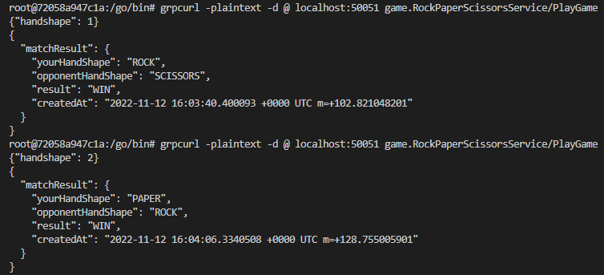
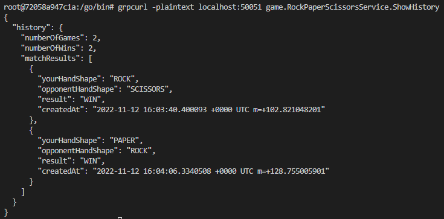

# janken_grpc
gRPCの勉強

## メモ
- google/protobuf/timestampがimportできなかった 
  - [このページ](https://qiita.com/revenue-hack/items/7221f8e015d47d894854)を参考にした
  - 結局stringで対応させた
- grpcurlをつかってサーバ側の動作確認をした

※実際の流れ（正しいかはわからない）
```bash
cd /janken_go_grpc
go get github.com/fullstorydev/grpcurl
cd $GOPATH
go install github.com/fullstorydev/grpcurl/cmd/grpcurl
```



## 参考
- [Go言語で簡単なgRPCサーバーを作成](https://dev.classmethod.jp/articles/golang-grpc-sample-project/)
- [gRPCサーバーの動作確認をgrpcurlでやってみた](https://qiita.com/yukina-ge/items/a84693f01f3f0edba482)
